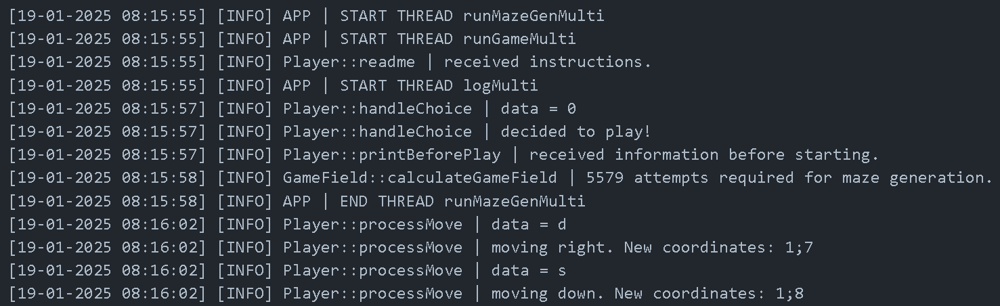

# Тестовое задание для стажера на направление «Разработчик C++» | Infotecs




Этот проект представляет собой библиотеку для записи сообщений в журнал с различными уровнями важности. Также в проекте имеется приложение, демонстрирующее работу данной библиотеки.

## Структура проекта

Проект состоит из следующих основных компонентов:

- **Библиотека** — содержит функции для записи сообщений в журнал с различными уровнями важности.
- **Тесты** — набор модульных тестов, проверяющих корректность работы библиотеки.
- **Приложение** — консольная игра "Лабиринт", демонстрирующая использование библиотеки в реальном приложении.

## Как собрать и запустить проект

1. Клонируйте репозиторий:

   ```bash
   git clone git@github.com:matw0x/infotecs.git
   ```

2. Перейдите в директорию проекта:

   ```bash
   cd infotecs
   ```

3. Установите библиотеку в систему:

   ```bash
   make install
   ```

4. Для компиляции тестов и основного приложения используйте команды:

   ```bash
   make test
   make app
   ```

5. Запустим:

   ```bash
   build/test                                      # для тестов
   build/app <filename>.txt <DEFAULT_LOG_LEVEL>    # для приложения
   ```

   Список уровней важности: INFO, WARNING, ERROR.
   Пример запуска приложения:

   ```bash
   build/app logs.txt INFO
   ```

   Также можно к своему сообщению добавлять уровень важности (по умолчанию INFO).
   Как это выглядит:

   ```bash
   d WARNING
   ```

   А уже здесь запишется с уровнем INFO:

   ```bash
   d
   ```

6. Изменим уровень важности по умолчанию.

   Это можно сделать как в начале, так и во время прохождения, написав '1'. Далее следуем инструкции, которая будет выведена на экран.

7. Для удаления библиотеки из системы:
   ```bash
   make uninstall
   ```
